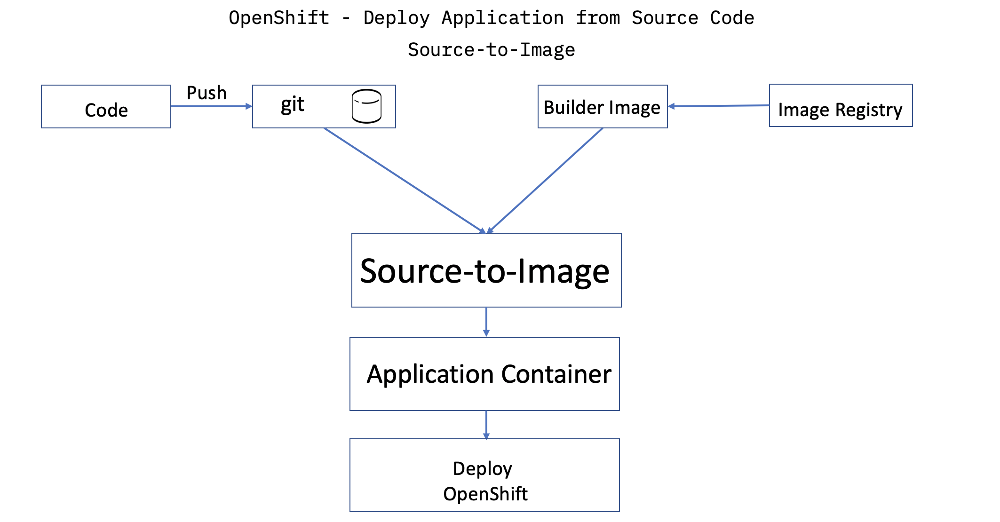
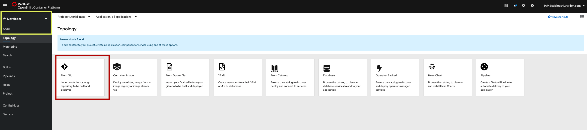
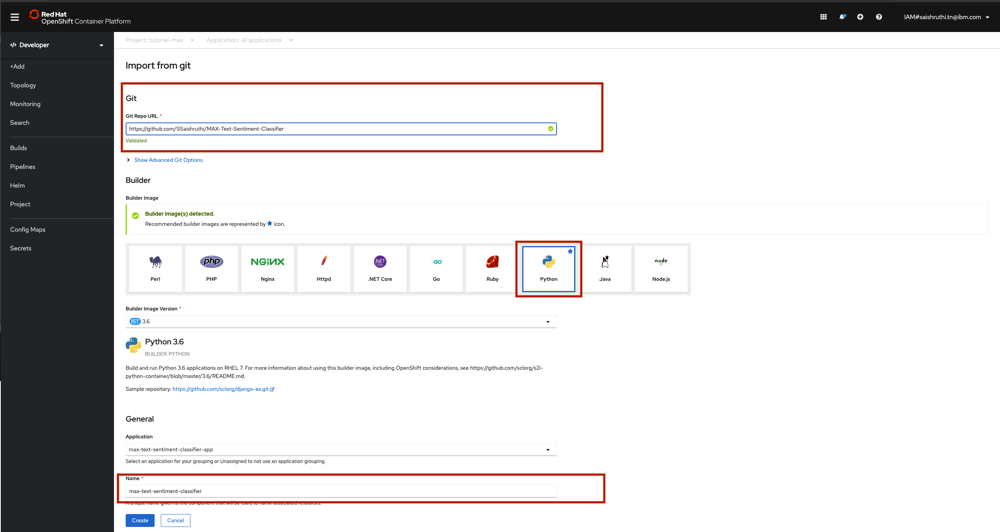
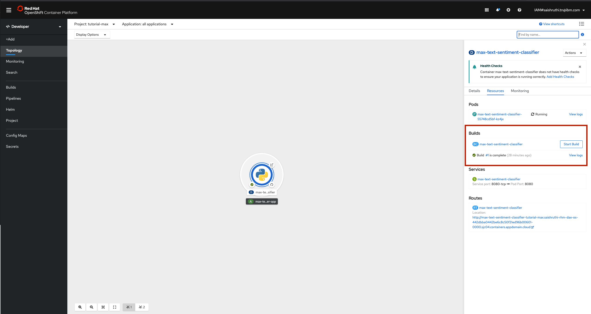
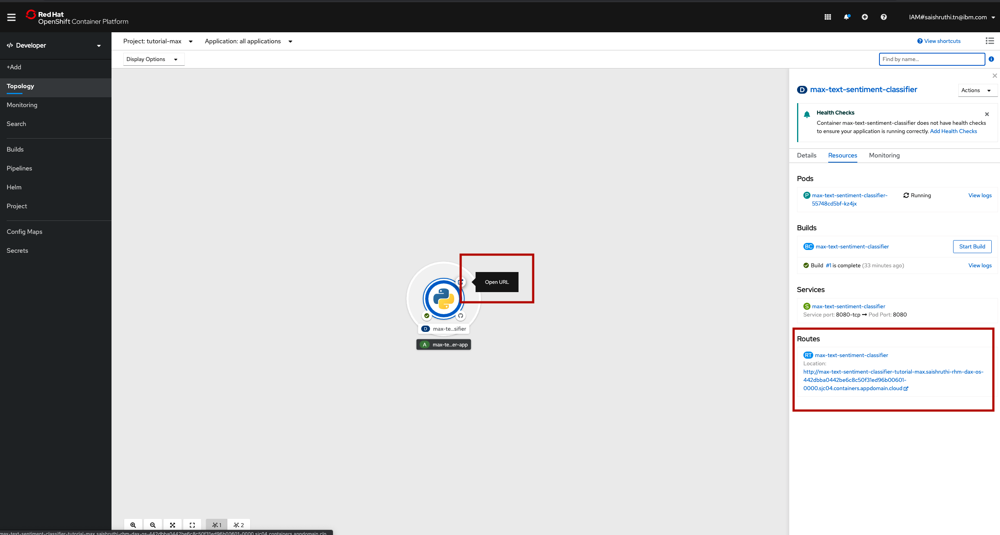

# MAX-Fashion-MNIST

#### Classify fashion and clothing items. 

<div align="center">
  
</div>

# Data Source: 

IBM Developer - [Data Asset Exchange](https://developer.ibm.com/exchanges/data/)

Curated free and open datasets under open data licenses for enterprise data science.

Link to download: https://developer.ibm.com/exchanges/data/all/fashion-mnist/

# Framework

The model is developed using the [Tensorflow](https://www.tensorflow.org/) framework.

# Labels
Each training and test example is assigned to one of the following labels:

| Label | Description |
| --- | --- |
| 0 | T-shirt/top |
| 1 | Trouser |
| 2 | Pullover |
| 3 | Dress |
| 4 | Coat |
| 5 | Sandal |
| 6 | Shirt |
| 7 | Sneaker |
| 8 | Bag |
| 9 | Ankle boot |

# Pre-requisite

- Follow the process provided in the [MAX-Skeleton](https://github.com/IBM/MAX-Skeleton) to provide REST API to the your model inference code.
- Basics of docker
- OpenShift

# What is Source-to-Image(S2I)?

Source-to-Image is a toolkit and workflow for building reproducible container images from the source code. S2I produces ready-to-run docker images by injecting source code into a container image and letting the conainer prepare that source code for execution.



# Steps

- Create a folder `.s2i` and add an file `environment`.
- Update the `environment` file with the script name you wish to run to start your application. Here it is `app.py`. Copy the below code in the file:
```
APP_FILE=app.py
```
- Login to your OpenShift cluster and open the web console
- Go to `Developer` view and click on `+Add`. We will be building the image from the source code stored in `Git`. Select `From Git`.

- Provide link to the source code stored in the git. Tool can automatically detect the builder image, make sure `Python` is selected. Provide name for the application and click `Create`.

- Application will start to build. You can view the logs by clicking on `View Logs`.

- Once built, click on the route and launch the application.

